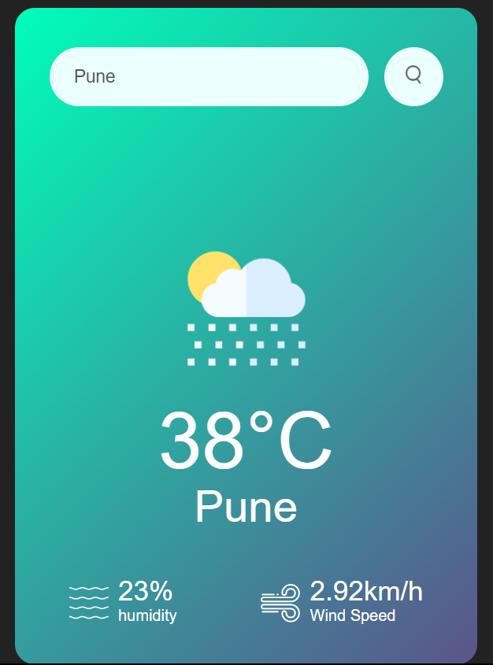

# Weather App

This is a simple Weather App project built using HTML, CSS, and JavaScript.

## Description
    
This Weather App allows users to check the current weather conditions of any location by entering the city name. It utilizes a weather API to fetch real-time weather data and displays it to the user.

## Features

- User-friendly interface
- Real-time weather updates

## Technologies Used

- HTML5
- CSS3 (Flexbox/Grid for layout)
- JavaScript (ES6+)
- OpenWeatherMap API

## Screenshot

